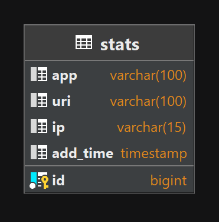
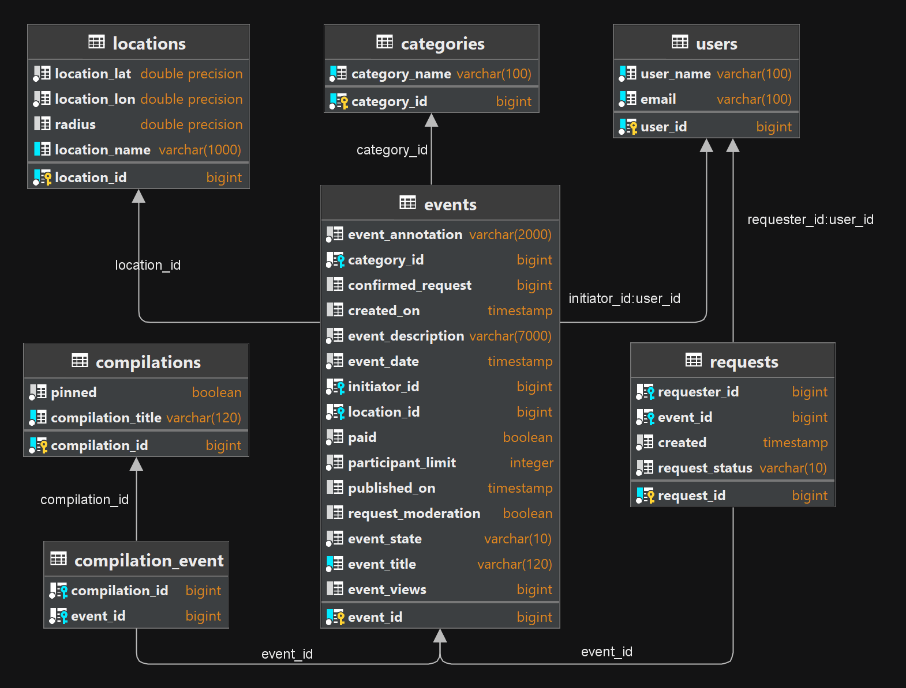

## Explore-with-me - backend service for events organization.

Explore-with-me allows you to organize events, view events, invite friends or participate in other events.

### Functional and structure:
Explore-with me application with microservice architecture that consists of two modules:
   1. Statistic module - stores the number of views allows you to collect statistics
      and make various selections to analyze the operation of the application. Consists of 3 submodules:
      - Stat-service - submodule that contains the main functionality, you can add hit or get statistic.  
      - Stat-dto - submodule that contains dto for public usage.  
      - Stat-client - allows you to send requests and process responses.  

   2. EWM module - the main functionality of the application. The functionality of the module can be divided into 3 parts:  
      - public API - provides the ability to search and filter events.  
      - private API - implements the capabilities of registered users. Add, update, get events. Confirmation and submission of requests for participation in the event.  
      - admin API - service setup and support. Add, update, delete categories for events. User management - add, get and delete. Event moderation. Add, remove compilations of events.  

Also, as a feature of this project you can add, remove or update location data of event, such as name, description, radius, lat, lon!

### Technology stack:
<a href="https://spring.io/">
  &nbsp;
</a>
<a href="https://maven.apache.org/">
  &nbsp;
</a>
<a href="https://www.postgresql.org/">
  &nbsp;
</a>
<a href="https://www.baeldung.com/the-persistence-layer-with-spring-data-jpa">
  &nbsp;
</a>
<a href="https://hibernate.org/">
  &nbsp;
</a>
<a href="https://projectlombok.org/">
  &nbsp;
</a>
<a href="https://mapstruct.org/">
  &nbsp;
</a>
<a href="https://www.docker.com/">
  &nbsp;
</a>

### System requirements:
JDK 11 amazon corretto  
IntellijIdea

### Startup instructions:
1. Download zip-file
2. Unpack zip-файл
3. Open app in IntellijIdea
4. mvn clean package
5. docker-compose up
6. Test app with postman tests collection in postman package